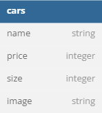

# Challenge Chapter 4 - Car Management Dasboard

This project is about implemetation of Database, Orm and Restful API.

## Database Diagram



## Library

1. cloudinary
2. cookie-parser
3. cors
4. dotenv
5. ejs
6. express
7. multer
8. nodemon
9. pg
10. sequelize

## How To Run

1. Install Library

```bash
npm i
```

2. Create Database

```bash
npm run db:create
```

3. Migrating the model

```bash
npm run db:migrate
```

4. Using seeder

```bash
npm run db:seed
```

5. Running Project on development

```bash
npm run dev
```

## EndPoint

### A. Restful API

1. Initial API | GET: http://{{host}}/
2. Get All Car | GET: http://{{host}}/cars
3. Upload A Car | POST: http://{{host}}/cars
4. Get Car by Id | GET: http://{{host}}/cars/:id
5. Delete A Car | DELETE: http://{{host}}/cars/:id
6. Update A Car | PUT: http://{{host}}/cars/:id
